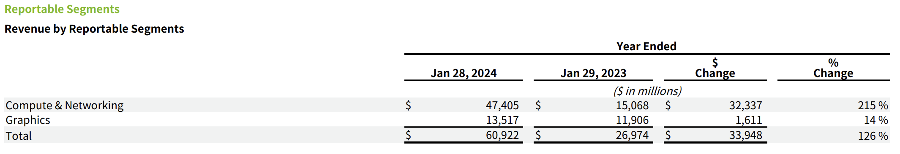
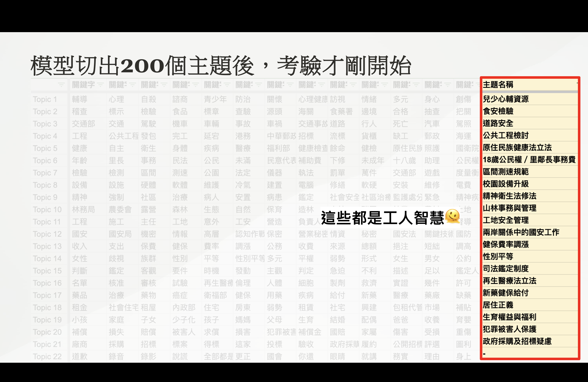

# 生成式 AI 實戰分享
# RAG 在實務中的多元應用


2024/10/09 陳奎銘 Ben 


---


<!-- .slide: data-background-iframe="media/Ben.html" -->


---

## Outline

- RAG ⮕ Retrival-Augmented Generation
- AI Knowledge Management
- 投資買美股
- 監督立委

---

# Retrival-Augmented Generation

----

<font color='#FF2D2D'>Retrival</font>-<font color='#66B3FF'>Augmented</font> <font color='#79FF79'>Generation</font>
## 透過<font color='#FF2D2D'>檢索</font><font color='#66B3FF'>加強</font><font color='#79FF79'>生成</font>答案的能力

##### ~~關鍵字搜尋~~<!-- .element: class="fragment" data-fragment-index="1" --> 
#### ⮕ 利用向量搜尋 <!-- .element: class="fragment" data-fragment-index="2" -->

----

### 稀疏向量 (Sparse Vectors)

- 維度 ⮕ 單詞
    - 對應到的單詞，其數值為 1
    - 其他為 0
    - one-hot encoding
- 隨詞彙量增長，向量維度急劇增加，可能達到數百萬維。
- 無法捕捉單詞之間的語義關聯。
----

### `One-Hot Encoding`
句子: 今天天氣很好 

|  | 今 | 天 | 氣 | 很 | 好 |
|---|---|---|---|---|---|
| 今 | 1 | 0 | 0 | 0 | 0 |
| 天 | 0 | 1 | 0 | 0 | 0 |
| 天 | 0 | 1 | 0 | 0 | 0 |
| 氣 | 0 | 0 | 1 | 0 | 0 |
| 很 | 0 | 0 | 0 | 1 | 0 |
| 好 | 0 | 0 | 0 | 0 | 1 |

----
### 密集向量 (Dense Vectors)
- 所有元素都有具體數值，沒有或很少有零值。
- 每個數字代表某種隱含語義或特徵，常用於 word embedding、圖像特徵提取等領域。
- 資訊量大、緊湊且適合相似度計算，如 Cosine Similarity。
- 今天天氣好好 ⮕ 

```
[0.8300, 0.4896, 0.9170, 0.9077, 0.4935, 0.8192, 0.8543, 0.7370, 0.2328, 0.2989, 
 0.1139, 0.2060, 0.7581, 0.6330, 0.2679, 0.5175, 0.5812, 0.6952, 0.3520, 0.3153, 
 0.5710, 0.7672, 0.5852, 0.5312, 0.2903, 0.1507, 0.5645, 0.3658, 0.0640, 0.1111, 
 0.6796, 0.4895, 0.5964, 0.7006, 0.2332, 0.7045, 0.7225, 0.1178, 0.7961, 0.5696, 
 0.9360, 0.0844, 0.9466, 0.4854, 0.6855, 0.8444, 0.3294, 0.4872, 0.7033, 0.5903, 
 0.8488, 0.8238, 0.0444, 0.5587, 0.3537, 0.8063, 0.6971, 0.7623, 0.0986, 0.4454, 
 0.9810, 0.0234, 0.5720, 0.8685]
```
----

#### `Cosine Similarity`

$$
 \cos(\theta) = \frac{A \cdot B}{\|A\| \|B\|} = \frac{\sum_{i=1}^{n} A_i B_i}{\sqrt{\sum_{i=1}^{n} A_i^2} \sqrt{\sum_{i=1}^{n} B_i^2}}
$$


----

### `Retrival-Augmented Generation`

- 結合『檢索』和『生成』，從外部知識中獲取答案
- 首先，將文件轉換成向量，存入向量資料庫
- 透過 cosine similarity 找到與問題最相近的片段
- 檢索 ⮕ 生成 ⮕ 回應

----


<font size=1>from: https://python.langchain.com/docs/modules/data_connection</font>

----

<!-- .slide: data-background-iframe="media/RAG.html" -->


----

### 生成式 AI 面臨的問題

- 知識有限
- Illusion（a.k.a 腦補）
- 資料安全與隱私
- Fine-tune 太貴太耗時

----

### RAG 的好處

- 動態知識更新
- 提高準確性
- 保護機敏資料
- 提高可解釋性


---

# AI Knowledge Management

----


----

### 解決方案

- **Qdrant**: 作為向量數據庫，進行高效的語義檢索
- **LangChain**: 提供檢索與生成的基礎框架
    - Generative Model: <font color='#79FF79'>gpt-4o</font>
    - Embedding Model: <font color='#FF2D2D'>text-embedding-3-large</font>
- **Streamlit**: 用於快速構建對話介面，便於即時展示
- **FastAPI**: 提供介面上傳檔案，並整合上述對話介面

----

### Sample code

```python [4-17|18-26|27-33]
def get_response(
    user_query, chat_history, collection_name
):
    generator_llm = AzureChatOpenAI()
    system_prompt = (
        "你是一位專門根據文件回答問題的 AI 助手。"
        "如果你無法從文件得到答案，請說你不知道。"
        "請根據以下參考資料回答問題："
        "歷史紀錄：{chat_history}"
        "參考資料：{context}"
    )
    prompt = ChatPromptTemplate.from_messages(
        [("system", system_prompt), ("human", "{input}")]
    )
    question_answer_chain = create_stuff_documents_chain(
        generator_llm, prompt)
    
    embedding_llm = AzureOpenAIEmbeddings()
    client = QdrantClient(url="http://localhost:6333")
    qdrant = QdrantVectorStore(
        client=client, 
        collection_name=collection_name, 
        embedding=embedding_llm
    )
    retriever = qdrant.as_retriever(
        search_kwargs={"k": 3})

    rag_chain = create_retrieval_chain(
        retriever, question_answer_chain)
    chain = rag_chain.pick("answer")
    return chain.stream({
        "input": user_query, 
        "chat_history": chat_history})


```

----

<!-- .slide: data-background="media/upload.png" -->

----

<!-- .slide: data-background="media/streamlit.png" -->


----

### 問問 `ChatGPT`


----


### Demo

<iframe width="720" height="480" src="https://www.youtube.com/embed/FG9wnHCbUyI?si=vCeMzNWUkDmFSEcf" title="YouTube video player" frameborder="0" allow="accelerometer; autoplay; clipboard-write; encrypted-media; gyroscope; picture-in-picture; web-share" referrerpolicy="strict-origin-when-cross-origin" allowfullscreen></iframe>

----


### 延伸應用- 與 GPT 的對話整理

- 匯出對話紀錄
- 生成 embedding vector
- 存入 vector database

----

<!-- .slide: data-background="media/export.png" -->


----


<!-- .slide: data-background="media/RAG_gpt.png" -->


----

### 小結

- 利用 RAG 做知識管理
    - 可以在各種主題上獲得精準的知識檢索和互動
    - 後續也能方便擴增資料範圍

---

# 投資也能用 RAG

----

## 用 27 個問題

----

## 平均年化報酬 13.6%

----

## 資金成長超過 10 倍

----

> Investment must be rational; if you can't understand it, don't do it.
> 
> —— Warren Buffett, *Forbes 400, 21 October 1991*

----

看財報來了解公司？

----

財報動不動就幾十頁......看得有點累......


----

這時候就要靠高級伴讀書僮- GPT！


----

先來問問 ChatGPT 問題～

----


<!-- .slide: data-background="media/chatgpt_1.png" -->


----

<!-- .slide: data-background="media/chatgpt_4o.png" -->


----

<!-- .slide: data-background="media/chatgpt_o1.png" -->


----

### `GPT-InvestAR`

> Gupta, U. (2023). GPT-InvestAR: Enhancing Stock Investment Strategies through Annual Report Analysis with Large Language Models. arXiv. https://arxiv.org/abs/2309.03079

----


<!-- .slide: data-background="#999999" -->

<!-- .slide: data-background-iframe="media/flow.html" -->


----

### 資料搜集

- 1505 stocks: 
    - S&P 500, S&P 400, S&P 600
    - 2002 ~ 2023
- Annual Report 
    - 10-K Filings
    - 美國證券交易委員會 SEC
    - [edgar-crawler](https://github.com/nlpaueb/edgar-crawler)
- Stock Price
    - 每日收盤價 (Adj Close)
    - Yahoo! Finace 

Note:
    美國證券交易委員會 SEC https://www.sec.gov/edgar/searchedgar/companysearch
    分年分配目標值：目的：為了在每年內相對排名股票的回報。方法：每年單獨分配股票的目標值，這樣可以更好地比較同一年內不同股票的表現。回報的排名和標準化：首先：回報首先被排名，這意味著根據其回報率對股票進行排序。然後：然後對排名後的回報進行標準化，這有助於消除數據中的任何潛在偏差或異常值。目標值的範圍限制：範圍：[0, 1]。解釋：其中1表示更高的回報，這意味著目標值1表示該股票在該年度有更高的回報。基於百分位數的分箱：最後：對標準化的回報進行分箱，基於百分位數，這樣目標值的範圍是[0, 1]。目的：這有助於創建一個更均勻和有序的目標值分布，可以更好地用於機器學習模型的訓練。


----


<!-- .slide: data-background="#ffffff" -->


<!-- .slide: data-background-iframe="media/2023-02-24.htm" -->

----

<!-- .slide: data-background="media/stock_price.png" -->


----

### 資料說明

- 總共 24,292 Data points
- Data points:
    - 某一檔股票某一年度的財報 ⮕ 分數
    - 觀察某一檔股票某一年度的股價變化 ⮕ 報酬率
    - 年度：
        - 開始：當年 10-K filings 發表後兩天
        - 結束：次年 10-K filings 發表前兩天
    - 同時以同樣方法觀察 S&P 500 的指數變化

----

### 資料分割

- Training Data:
    - 2002 ~ 2017
    - *1000* data points (out of 17.4k) 
- Test Data:
    - 2018 ~ 2023 
    - *500* data points (out of 6.8k) 

Note:  
    - 分年分配目標值：
        - 目的：為了在每年內相對排名股票的回報。
        - 方法：每年單獨分配股票的目標值，這樣可以更好地比較同一年內不同股票的表現。
    - 回報的排名和標準化：
        - 首先：回報首先被排名，這意味著根據其回報率對股票進行排序。
        - 然後：然後對排名後的回報進行標準化，這有助於消除數據中的任何潛在偏差或異常值。
    - 目標值的範圍限制：範圍：[0, 1]。
        - 解釋：其中1表示更高的回報，這意味著目標值1表示該股票在該年度有更高的回報。
    - 基於百分位數的分箱：
        - 最後：對標準化的回報進行分箱，基於百分位數，這樣目標值的範圍是[0, 1]。
        - 目的：這有助於創建一個更均勻和有序的目標值分布，可以更好地用於機器學習模型的訓練。
    - 最後得到 Target：0, 0.25, 0.5, 0.75, 1

----


### Create Feature


- Feature: Confidence Score
    - 請 GPT (GPT-3.5-Turbo) 依照公司的財報回答問題，給予<font color='red'>評分</font>
        - 為財報建立 Vector Store
            - Model: [all-<font color='red'>mpnet</font>-base-v2](https://huggingface.co/sentence-transformers/all-mpnet-base-v2)
            - Vector DB: Chroma
        - 準備關於財報的問題
        


----

### 準備關於財報的問題- 直接交給 GPT

- 利用關鍵字產生 27 個問題

```
{
  "feature_overall": "On a scale of 0 to 100, how would you rate the company's overall performance and prospects based on the annual report?",
  "feature_revenue_1": "Based on the annual report, how would you rate the company's revenue performance in the last fiscal year on a scale of 0 to 100?",
  "feature_revenue_2": "On a scale of 0 to 100, how successful has the company been in expanding into new markets or segments that contributed to revenue?",
  "feature_revenue_3": "How effective were the company's strategies in increasing revenue streams, on a scale of 0 to 100?",
  "feature_profit_1": "Rate the company's profit margins in the last fiscal year on a scale of 0 to 100.",
  "feature_profit_2": "How effective has the company been in implementing cost-saving measures to improve profit margins, on a scale of 0 to 100?",
  "feature_debt_1": "Rate the company's debt management and current debt structure on a scale of 0 to 100.",
  "feature_cashflow_2": "How would you rate the company's cash flow performance in the recent fiscal year on a scale of 0 to 100?",
  "feature_dividend": "Based on the annual report, how would you rate the company's dividend payouts or changes to its dividend policy on a scale of 0 to 100?",
  "feature_management_1": "Rate the effectiveness of the significant decisions made by the management in the recent year on a scale of 0 to 100.",
  "feature_management_2": "How successful has the management been in initiating strategic partnerships or alliances, on a scale of 0 to 100?",
  "feature_industry_1": "Rate the company's positioning and competitive advantages in its industry on a scale of 0 to 100.",
  "feature_industry_2": "How proactive has the company been in identifying new industry trends or opportunities for expansion, on a scale of 0 to 100?",
  "feature_research": "Rate the company's investments in research and development on a scale of 0 to 100.",
  "feature_guidance": "Based on the annual report, how clear and promising is the company's financial guidance or outlook for the upcoming fiscal year on a scale of 0 to 100?",
  "feature_leadership": "Rate the effectiveness and vision of the company's leadership or organizational structure on a scale of 0 to 100.",
  "feature_macro": "How well is the company adapting to macroeconomic factors and global market trends, on a scale of 0 to 100?",
  "feature_diversification": "Rate the company's diversification strategies in terms of mitigating risks and enhancing growth on a scale of 0 to 100.",
  "feature_customerbase": "How would you rate the company's efforts in expanding its customer base or improving customer retention on a scale of 0 to 100?",
  "feature_esg": "Rate the company's initiatives in terms of environmental, social, and governance (ESG) factors on a scale of 0 to 100.",
  "feature_competition_1": "Rate the company's positioning against its primary competitors on a scale of 0 to 100.",
  "feature_competition_2": "How well has the company identified and addressed new competitive threats or market challenges, on a scale of 0 to 100?",
  "feature_ip": "Rate the company's efforts in securing new intellectual property or patents on a scale of 0 to 100.",
  "feature_digitaltransformation": "How would you rate the company's steps towards digital transformation and technological advancements on a scale of 0 to 100?",
  "feature_regulations": "Rate the company's efforts in navigating regulatory challenges and compliance requirements on a scale of 0 to 100.",
  "feature_onlinepresence": "How effective has the company been in expanding its online presence and digital marketing strategies, on a scale of 0 to 100?",
  "feature_legal": "Based on the annual report, how would you rate the company's handling of legal issues or litigation in the recent year on a scale of 0 to 100?"
}

```

----

### RAG- 利用 prompt template 提問


```python
query_engine = index.as_query_engine(
    text_qa_template=text_qa_template)
question = """
Based on the annual report, 
how would you rate the company's revenue performance 
in the last fiscal year on a scale of 0 to 100?"""
response = query_engine.query(question)
print(reponse.response)

print(response.metadata)

```
```python
score: 90

{'3890cf8c-9960-4832-ba3b-c8daf46d9f26': 
    {'page_label': '39', 
    'file_name': '2024-02-21.pdf', 
    'file_path': '2024-02-21.pdf', 
    'creation_date': '2024-03-09', 
    'last_modified_date': '2024-03-09', 
    'last_accessed_date': '2024-03-09'}, 
'c357dbb4-a2c6-4e22-b885-5642157050ef': 
    {'page_label': '50', 
    'file_name': '2024-02-21.pdf', 
    'file_path': '2024-02-21.pdf', 
    'creation_date': '2024-03-09', 
    'last_modified_date': '2024-03-09', 
    'last_accessed_date': '2024-03-09'}}

```


----

### RAG 的效果
- 以 NVDA 2024-02-21 的財報為例：
> Based on the annual report, how would you rate the company's <font color='red'>revenue performance</font> in the last fiscal year on a scale of 0 to 100?

----

### RAG 的效果


- Page: 39
    - Revenue Change: <font color='red'>126%</font>
- The confidence score for the company's revenue performance in the last fiscal year is <font color='red'>90</font> out of 100.


----

### Model

- Linear Regression: enforces non-negativity in the coefficients
    - Input
        - Confidence Scores from GPT-3.5-Turbo
    - Output
        - Target Value from Stock Price

----

### Cost

- Money: $122.46 + $29 = $151.46
- Time: 214 hours
    - Build Vector Store: 190 hours
    - Get Confidence Score: 24 hours
- 4 core CPU + 16G RAM 
- Storage: ~115 G


----

### Result

- 假設一開始投入 $1 
- 選擇每年最強 5 檔股票
- 複利


----


----

### 小問題

- 每間公司 10-K filings 公佈時間實際上是散佈在 12 個月
- 若在年底觀察完該年度所有公司的 10-K filings，卻發現....
    - 最強股票其實在一月就公布財報了...... <!-- .element: class="fragment" data-fragment-index="1" -->
    - 需要時光機..... <!-- .element: class="fragment" data-fragment-index="2" -->

----

### 滾動式作法

- 建立模型
    - 以 2002 年的資料開始建立模型，作為初始模型
    - 隔年年初重新訓練一次模型
- 挑選股票
    - 每個月取得該年度當下可取得的財報
    - 於月底預測未來 12 個月最強的五檔股票
- 月初開盤進場，月底收盤出場
- 避開突發的損失
    - 下跌 10 % 就停止交易
    - 觀察後續的情況，若可獲利，隔月進場下單


----

<!-- .slide: data-background-iframe="media/rolling_model_2003_2022_trick.html" -->


----

<!-- .slide: data-background-iframe="media/rolling_annual_return_2003_2022_trick.html" -->


----

### 回測績效

- 年化報酬率：13.6%
- 最大交易回落：27.1%
- Sharpe Ratio: 0.088
- 勝率：62.5%

----


<!-- .slide: data-background-iframe="media/cumulative_amount_2003_20240227_sp500_trick.html" -->

----

這個做法，會不會需要投入很多資金？

----

<!-- .slide: data-background-iframe="media/rolling_k_return_expense.html" -->


----


<h2><font color='black'>自動化</font></h2>

<!-- .slide: data-background="media/airflow.png" -->


----


----

如果不想麻煩的話，還是......

----

ETF and Chill


----

## 小結

- 有機會打敗大盤的獲利方式- GPT-InvestAR
    - 利用 GPT 和 RAG 將年報化為分數
    - 利用分數建立 Machine Learning Model
- 實際的進出場策略，須考慮實務上的情況

----

## 財報靠 GPT

----

## 投資靠自己


---


# 監督立委

----

<!-- .slide: data-background="media/Helene_Reporter.png" -->

----

### 如何讓一般選民綜觀四年，自家立委關心哪些議題？立場是什麼？

- 低門檻
- 白話文
- 可統整歸納

----

### 整理立委的發言


----

### 斷詞 + LDA



Note:
    - LDA（Latent Dirichlet Allocation，潛在狄利克雷分配）是一種主題模型，用於從大規模的文本數據集中發現隱含的主題。LDA 通常用於自然語言處理（NLP）中的文本分析。它透過對文檔中的詞進行統計建模來識別一組潛在的主題，並假設每個文檔都是由若干個主題的詞組成的，且每個主題是由一些特定的詞所構成。
    - LDA 的核心概念：
        - 文檔-主題分佈：LDA 假設每篇文檔可以用多個主題來描述，每個主題在文檔中的出現比例不同。例如，一篇新聞報導可能同時涉及「環保」和「政治」這兩個主題，但比例可能不同。
        - 主題-詞分佈：每個主題包含一組詞，這些詞根據其在主題中的相關性出現。例如，「環保」這個主題可能包含「污染」、「氣候變遷」、「能源」等詞。
        - 詞袋模型（Bag of Words）：LDA 使用詞袋模型，這種方法將文本視作詞的無序集合，不考慮詞的順序，但考慮詞的頻率。

----

### 改用 GPT + RAG 

- 立委公報 ⮕ pdf ⮕ csv
- 立委基本資料 + 議題列表
- GPT 幫忙對立委發言分類 + 摘要
- 建置RAG用資料庫：時事報導與議題


----

### 記者的咒語- Prompt

- 這是一份是議題分類清單：{議題列表}
- 這是一段立委與官員的對話：{發言逐字稿}
- 這是與對話相關的時事背景：{報導或議題研析}
- 請進行主題命名與立委發言摘要，聚焦引述的核心律法、訴求與主張。


----

<!-- .slide: data-background="media/Reporter_RAG_example.png" -->


----


<!-- .slide: data-background="media/legislator_dashboard.png" -->


----

<!-- .slide: data-background="media/AI_abstrator.png" -->

----

### 資料開放
- 立法院 API：https://ly.govapi.tw/
- 本土政治時事資料庫：https://huggingface.co/aigrant
- 第10屆立院議題列表：
https://github.com/data-reporter/10th_Legislator_Speech

----

### 總結

- **RAG 的多元應用**：
    - 跨越不同領域，解決各種獨特的問題
- **問題驅動學習**：
    - 針對具體問題進行學習和技術應用
- **掌握領域知識**：
    - 專業知識與技術結合，才能精確地解決問題

---

## 投影片


----

## `R-Ladies Taipei`


</img>

----

# Thank You
