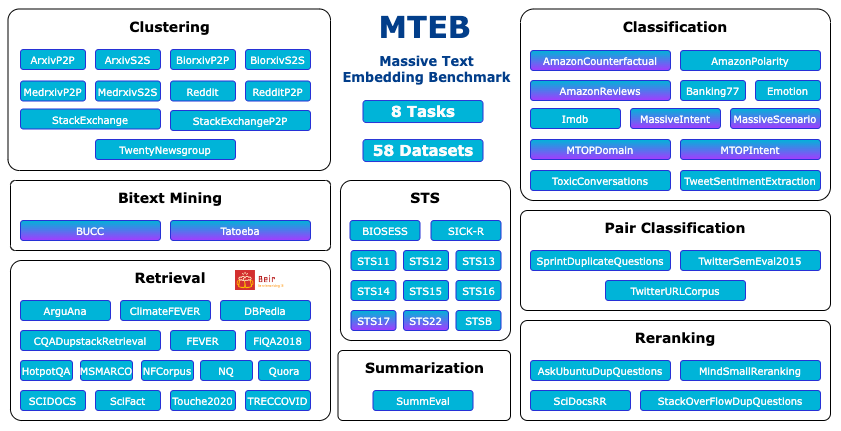
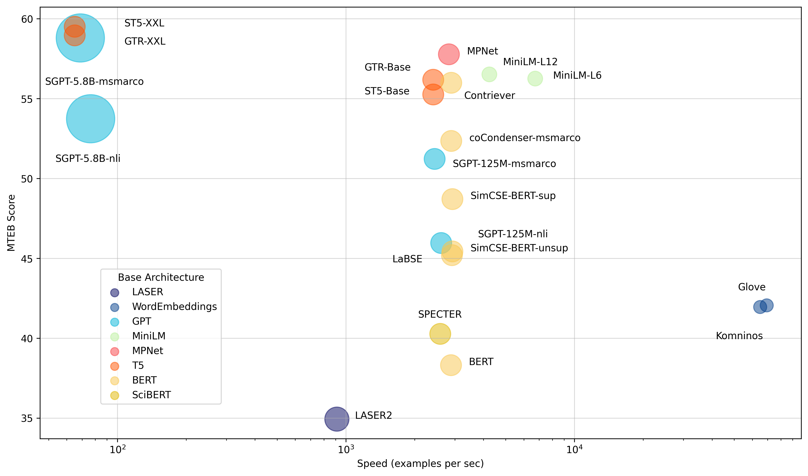
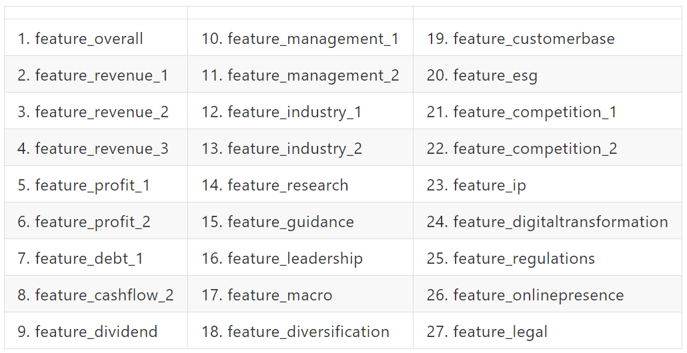
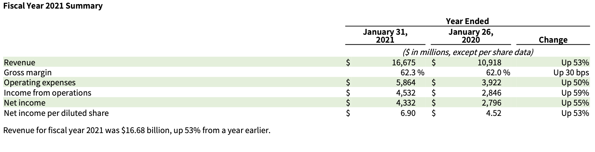

# 投資？我都交給我的高級伴讀書僮- GPT！

Note:
    耽誤一下各位下午打瞌睡的時間，讓我分享一點點有點有趣有點興奮的小東西，讓你們稍微提神一下

---


<!-- .slide: data-background-iframe="media/Ben.html" -->


---

### 用 27 個問題

----

## 平均年化報酬 13.6%

----

# 資金成長超過 10 倍

---

> Investment must be rational; if you can't understand it, don't do it.
> 
> —— Warren Buffett, *Forbes 400, 21 October 1991*

----

看財報來了解公司？

----

財報動不動就幾十頁......看得有點累......


----

這時候就要靠高級伴讀書僮- GPT！

---

## 以下是我不會講的

- 原理
- 數學
- 明牌

----

## 以下是我會講的

- 作法與流程
- 血汗與花費
- 地雷


----

先來問問 ChatGPT 問題～

----


<!-- .slide: data-background="media/chatgpt_1.png" -->


----

<!-- .slide: data-background="media/chatgpt_2.png" -->


----

發現一篇可能可以解決我的問題的 Paper

----

## `GPT-InvestAR`

> Gupta, U. (2023). GPT-InvestAR: Enhancing Stock Investment Strategies through Annual Report Analysis with Large Language Models. arXiv. https://arxiv.org/abs/2309.03079

----


這時候應該要用 RAG

## Retrival Augmented Generation

----


<!-- .slide: data-background-iframe="media/RAG.html" -->

----


<font size=1>from: https://python.langchain.com/docs/modules/data_connection</font>

---

投資一定有風險，基金投資有賺有賠，申購前應詳閱公開說明書。

---

<!-- .slide: data-background="#999999" -->

<!-- .slide: data-background-iframe="media/flow.html" -->


---

## Data
- Annual Report 
    - 10-K Filings
- Stock Price
    - 只限美股


----


<!-- .slide: data-background="#ffffff" -->


<!-- .slide: data-background-iframe="media/2023-02-24.htm" -->


----

### Annual Report (10-K filings)

- 原作使用：
    - [Financial Modeling Prep](https://site.financialmodelingprep.com/developer/docs/#Annual-Reports-on-Form-10-K)
    - 費用：29 美元/月
- 建議使用：
    - 使用爬蟲 [edgar-crawler](https://github.com/nlpaueb/edgar-crawler) 在 [SEC 美國證券交易委員會](https://www.sec.gov/edgar/searchedgar/companysearch) 抓取 10-k filings
    - 費用：免費

----

### Stock Price
- total 1505 stocks
    - S&P 500 (大)
    - S&P 400 (中)
    - S&P 600 (小)
- 原作使用：
    - [`openbb`](https://openbb.co/)
- 建議使用：
    - [`yfinance`](https://finance.yahoo.com/)：Yahoo! Finance

----

<!-- .slide: data-background="media/stock_price.png" -->


---

## PreProcessing

- Sampling
- Make Target
- Create Feature


---

### Sampling

- 總共 24,292 Data points
- Data points:
    - 某一檔股票某一年度的財報
    - 觀察某一檔股票某一年度的股價變化 --> 報酬率
    - 年度：
        - 開始：當年 10-K filings 發表後兩天
        - 結束：次年 10-K filings 發表前兩天
    - 同時以同樣方法觀察 S&P 500 的指數變化

----

### Sampling

- Training Data:
    - 2002 ~ 2017
    - *1000* data points (out of 17.4k) 
- Test Data:
    - 2018 ~ 2023 
    - *500* data points (out of 6.8k) 

----


<!-- .slide: data-background="#999999" -->

<!-- .slide: data-background-iframe="media/flow.html" -->

----


<!-- .slide: data-background="#999999" -->

<!-- .slide: data-background-iframe="media/make_target.html" -->


----

### Make Target

- Target:
    - 12-Month Return: 年報酬率
        - Annual Return 
    - Max Return: 最大報酬率
        - 98th percentile of return from the filing date represented as Target Max


----

### Make Target

- 將抽樣後的報酬率，依每年排序
- 針對排名做標準化
- 求出百分位數後，依照百分位數做分組
- 最後得到 Target：0, 0.25, 0.5, 0.75, 1
Note:  
    分年分配目標值：目的：為了在每年內相對排名股票的回報。方法：每年單獨分配股票的目標值，這樣可以更好地比較同一年內不同股票的表現。回報的排名和標準化：首先：回報首先被排名，這意味著根據其回報率對股票進行排序。然後：然後對排名後的回報進行標準化，這有助於消除數據中的任何潛在偏差或異常值。目標值的範圍限制：範圍：[0, 1]。解釋：其中1表示更高的回報，這意味著目標值1表示該股票在該年度有更高的回報。基於百分位數的分箱：最後：對標準化的回報進行分箱，基於百分位數，這樣目標值的範圍是[0, 1]。目的：這有助於創建一個更均勻和有序的目標值分布，可以更好地用於機器學習模型的訓練。

----

<!-- .slide: data-background="#999999" -->

<!-- .slide: data-background-iframe="media/flow.html" -->

----


<!-- .slide: data-background="#999999" -->

<!-- .slide: data-background-iframe="media/create_feature.html" -->

----

### Create Feature

- Build Vector Store
    - Model: all-mpnet-base-v2
    - Vector DB: Chroma
- Feature: Confidence Score
    - 準備關於財報的問題
    - 請 GPT (GPT-3.5-Turbo) 依照公司的財報回答問題，給予評分
        - 原作：OpenAI 
        - Ben：Azure OpenAI

----


### Sentence-Transformers Model

- all-mpnet-base-v2
    - maps sentences & paragraphs to a 768 dimensional dense vector space
    - Can be used for tasks like clustering or semantic search
    - https://huggingface.co/sentence-transformers/all-mpnet-base-v2


----

#### Massive Text Embedding Benchmark
https://huggingface.co/blog/mteb


----



----

### all-mpnet-base-v2
- Speed and performance balance
- Slightly slower
- Significantly stronger

----

### 準備關於財報的問題

- 27 Questions
- Paper 沒有明講，只有以下範例
> Does the company have a clear strategy for growth and innovation? 
> Are there any recent strategic initiatives or partnerships?

----

寄信問作者，作者回答......

----

<iframe width="560" height="315" src="https://www.youtube.com/embed/X_9lP3hM--E?si=zUgn6G2QIYAOazdY" title="YouTube video player" frameborder="0" allow="accelerometer; autoplay; clipboard-write; encrypted-media; gyroscope; picture-in-picture; web-share" allowfullscreen></iframe>

----

### 藏在程式碼的小提示




----

### GPT 幫我問問題

```
{
  "feature_overall": "On a scale of 0 to 100, how would you rate the company's overall performance and prospects based on the annual report?",
  "feature_revenue_1": "Based on the annual report, how would you rate the company's revenue performance in the last fiscal year on a scale of 0 to 100?",
  "feature_revenue_2": "On a scale of 0 to 100, how successful has the company been in expanding into new markets or segments that contributed to revenue?",
  "feature_revenue_3": "How effective were the company's strategies in increasing revenue streams, on a scale of 0 to 100?",
  "feature_profit_1": "Rate the company's profit margins in the last fiscal year on a scale of 0 to 100.",
  "feature_profit_2": "How effective has the company been in implementing cost-saving measures to improve profit margins, on a scale of 0 to 100?",
  "feature_debt_1": "Rate the company's debt management and current debt structure on a scale of 0 to 100.",
  "feature_cashflow_2": "How would you rate the company's cash flow performance in the recent fiscal year on a scale of 0 to 100?",
  "feature_dividend": "Based on the annual report, how would you rate the company's dividend payouts or changes to its dividend policy on a scale of 0 to 100?",
  "feature_management_1": "Rate the effectiveness of the significant decisions made by the management in the recent year on a scale of 0 to 100.",
  "feature_management_2": "How successful has the management been in initiating strategic partnerships or alliances, on a scale of 0 to 100?",
  "feature_industry_1": "Rate the company's positioning and competitive advantages in its industry on a scale of 0 to 100.",
  "feature_industry_2": "How proactive has the company been in identifying new industry trends or opportunities for expansion, on a scale of 0 to 100?",
  "feature_research": "Rate the company's investments in research and development on a scale of 0 to 100.",
  "feature_guidance": "Based on the annual report, how clear and promising is the company's financial guidance or outlook for the upcoming fiscal year on a scale of 0 to 100?",
  "feature_leadership": "Rate the effectiveness and vision of the company's leadership or organizational structure on a scale of 0 to 100.",
  "feature_macro": "How well is the company adapting to macroeconomic factors and global market trends, on a scale of 0 to 100?",
  "feature_diversification": "Rate the company's diversification strategies in terms of mitigating risks and enhancing growth on a scale of 0 to 100.",
  "feature_customerbase": "How would you rate the company's efforts in expanding its customer base or improving customer retention on a scale of 0 to 100?",
  "feature_esg": "Rate the company's initiatives in terms of environmental, social, and governance (ESG) factors on a scale of 0 to 100.",
  "feature_competition_1": "Rate the company's positioning against its primary competitors on a scale of 0 to 100.",
  "feature_competition_2": "How well has the company identified and addressed new competitive threats or market challenges, on a scale of 0 to 100?",
  "feature_ip": "Rate the company's efforts in securing new intellectual property or patents on a scale of 0 to 100.",
  "feature_digitaltransformation": "How would you rate the company's steps towards digital transformation and technological advancements on a scale of 0 to 100?",
  "feature_regulations": "Rate the company's efforts in navigating regulatory challenges and compliance requirements on a scale of 0 to 100.",
  "feature_onlinepresence": "How effective has the company been in expanding its online presence and digital marketing strategies, on a scale of 0 to 100?",
  "feature_legal": "Based on the annual report, how would you rate the company's handling of legal issues or litigation in the recent year on a scale of 0 to 100?"
}

```

----

### RAG 的效果
- 以 NVDA 2021-02-26 的財報為例：
> Based on the annual report, how would you rate the company's revenue performance in the last fiscal year on a scale of 0 to 100?

----

### RAG 的效果


The confidence score for the company's revenue performance in the last fiscal year is 95 out of 100.

----

## Cost
- 原作
    - Money: $60
    - Time: 50 hours
- Ben
    - Money: $122.46 + $29 = $151.46
    - Time: 214 hours
        - Build Vector Store: 190 hours
        - Get Confidence Score: 24 hours
    - Storage: ~115 G


---

## Model Training

----


<!-- .slide: data-background="#999999" -->

<!-- .slide: data-background-iframe="media/flow.html" -->

----


<!-- .slide: data-background="#999999" -->

<!-- .slide: data-background-iframe="media/training.html" -->


----

## Model

- Linear Regression: enforces non-negativity in the coefficients
- Input
    - Confidence Scores from GPT-3.5-Turbo
- Output- Target Value
    - 12-Month Return 年報酬率
    - Max Return 最大報酬率


---

## Result


----

### 挑出最強 K 檔股票

----


<!-- .slide: data-background="media/result_12m_k.png" -->

----

<!-- .slide: data-background="media/result_max_k.png" -->


----

### 假設一開始投入 $1 
- 每年選擇最強 5 檔股票
- 複利
- 四種排列組合
    - 以年報酬率模型和最大報酬率模型
        - 預測年報酬率
        - 預測最大報酬率

----


<!-- .slide: data-background="media/result_12m_12m.png" -->

----

<!-- .slide: data-background="media/result_12m_max.png" -->

----


<!-- .slide: data-background="media/result_max_12m.png" -->

----

<!-- .slide: data-background="media/result_max_max.png" -->

----

### 小問題

- 每間公司 10-K filings 公佈時間不會集中在某段時間，而是散佈在 12 個月
- 若在年底觀察完該年度所有公司的 10-K filings，卻發現....
    - 最強股票其實在一月就公布財報了...... <!-- .element: class="fragment" data-fragment-index="1" -->
    - 需要時光機..... <!-- .element: class="fragment" data-fragment-index="2" -->

----

### 滾動式作法

- 建立模型
    - 以 2002 年的資料開始重新建立模型，作為初始模型
    - 每年年底重新訓練一次模型
- 挑選股票
    - 每個月取得該年度當下可取得的財報
    - 依照新模型的預測結果，於月底挑出未來 12 個月最強的五檔股票
- 月初開盤進場，月底收盤出場


----

<!-- .slide: data-background-iframe="media/rolling_model_2003_2022.html" -->


----

- 避開突發的損失
    - 下跌 10 % 就停止交易
    - 觀察後續的情況，若可獲利，再下個月就進場下單


----

<!-- .slide: data-background-iframe="media/rolling_model_2003_2022_trick.html" -->


----

<!-- .slide: data-background-iframe="media/rolling_annual_return_2003_2022_trick.html" -->


----

### 回測績效

- 年化報酬率：13.6%
- 最大交易回落：27.1%
- Sharpe Ratio: 0.088
- 勝率：62.5%

---

這個做法，會不會很花錢啊？

----

<!-- .slide: data-background-iframe="media/rolling_k_return_expense.html" -->


---

如果不想麻煩的話，還是......

----

ETF and Chill

---

## 總結

- 有機會打敗大盤的獲利方式- GPT-InvestAR
    - 利用 GPT 和 RAG 將年報化為分數
    - 利用分數建立 Machine Learning Model
- 實際的進出場策略，須考慮實務上的情況

----

# 財報靠 GPT

----

# 投資靠自己

---

<!-- .slide: data-background="media/AI_music_QR.png" -->


----


<!-- .slide: data-background-iframe="https://www.onelab.tw/Partner.html" -->


----


## 徵才


|                      Data 人才趕快來                      |                  直接跟 Ben 聯絡                   |
|:--------------------------------------------------:|:--------------------------------------------------:|
|  |  |
|<font size=5>https://www.onelab.tw/Partner.html</font> | <font size=5>benjamin0901@gmail.com</font> |

----

# Thank You
